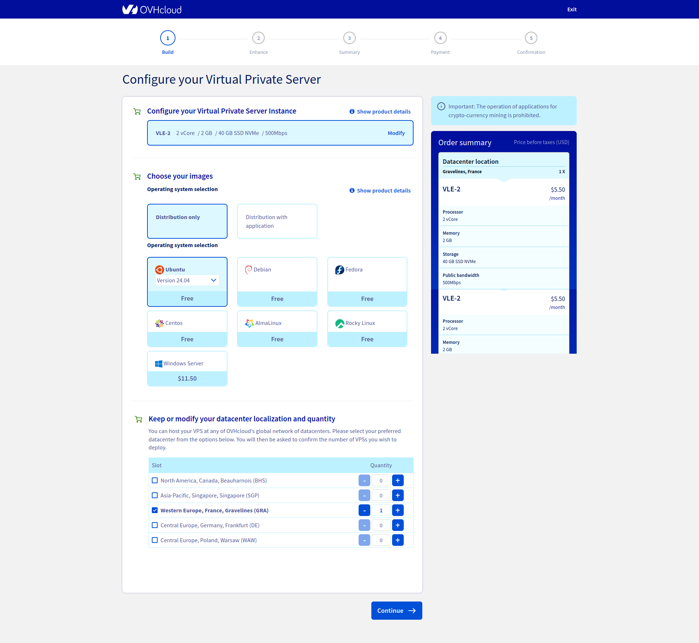
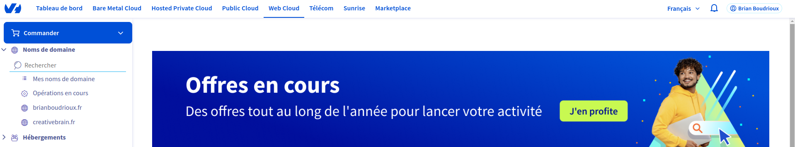
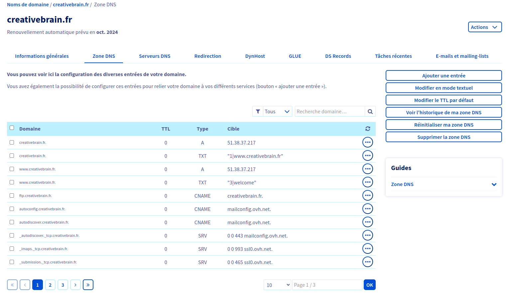
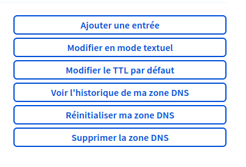
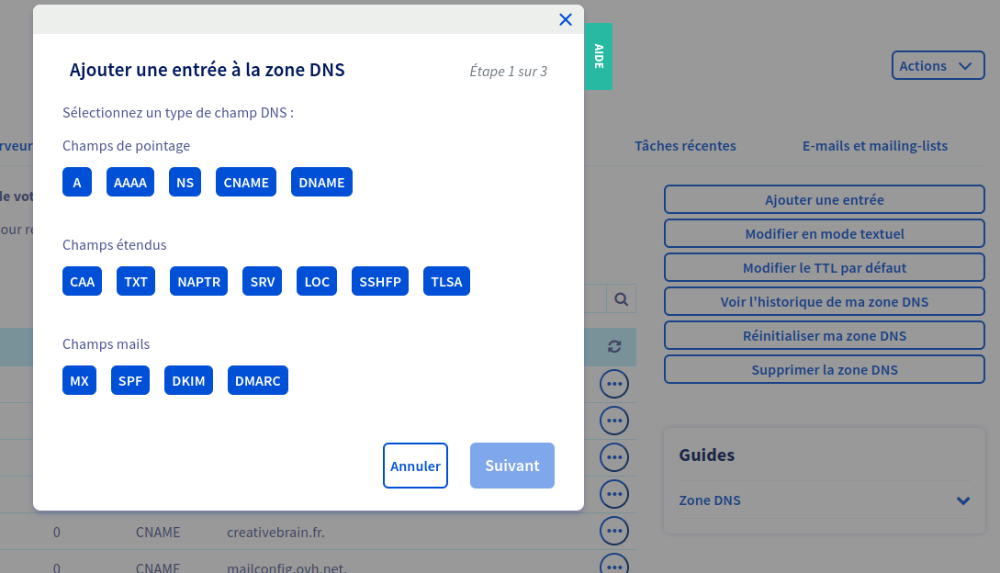
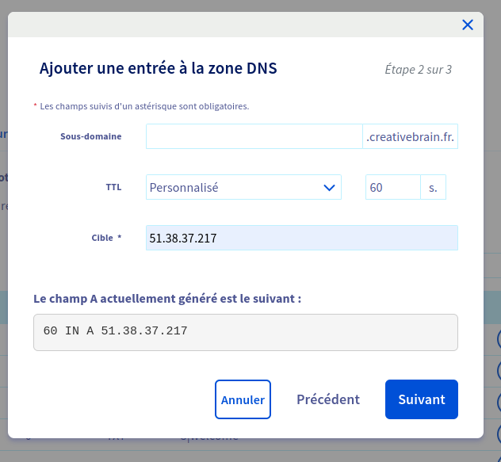

# Deploying a fullstack js app on a VPS with Nginx 

[⬅ Version Française](./README-FR)


## Introduction


A server is a computer that communicates with other computers to serve them with the information requested by these computers. These computers, also called clients, connect to a server through either a local area network (LAN) or a wide area network (WAN). A server sends and collects information across a network within multiple locations.

A web server is a server on the internet that uses the Hypertext Transfer Protocol (HTTP) to receive requests from a client, such as a browser. It then returns an HTTP response, which can be an HTML webpage or data in JSON format, as used in API calls.

Web servers, essential for data exchange, use HTTP for client-server communication. They consist of both hardware and software, crucial in web development. The software interprets URLs and manages user access to hosted files.

### Deployment overview


The deployment diagram above allows you to visualize the architecture of our server which will host both our react application as well as our express API and our mySQL database.

Let's take a look at the elements that make it up:

- The client, in other words the user of the site on a physical machine
- The server (hardware) in other words, a physical machine connected to the internet, in our case it is a virtual private server (VPS).
- Nginx, a web server (software) which allows us to manage http requests, this one is directly installed on the physical server and is used to redirect to the corresponding service in our case we have two options either our client application (react) or our api (express/harmonia).
- Static files (react)
- A NodeJS server (express/harmonia)
- A database server (mySQL)

### Web server & reverse proxy


A traditional forward proxy server allows multiple clients to route traffic to an external network. For instance, a business may have a proxy that routes and filters employee traffic to the public Internet. A reverse proxy, on the other hand, routes traffic on behalf of multiple servers.

A reverse proxy effectively serves as a gateway between clients, users, and application servers. It handles all the access policy management and traffic routing, and it protects the identity of the server that actually processes the request.

## Preparation

### Choosing a vps

In today's digital age, Virtual Private Servers (VPS) have become an integral part of web hosting, development, and server administration. VPS hosting provides the flexibility of a dedicated server while being cost-effective and easy to manage.

As part of this workshop we will order a vps on OVH but there are plenty of equally viable service providers.

To do this, go to this [link](https://www.ovhcloud.com/fr/vps/) and configure your vps as indicated in the screenshot below



### Choosing a domain name

A domain name (often simply called a domain) is an easy-to-remember name that's associated with a physical IP address on the Internet. It's the unique name that appears after the @ sign in email addresses, and after www. in web addresses.

For order a domain name on OVH you can follow this [link](https://www.ovhcloud.com/fr/domains/)

### Link the domain name to the vps

Once your VPS is ordered you will receive an email with the connection information to it including the IP, from your OVH dashboard you will be able to link your VPS via its IP address to your domain name by configuring what we call a DNS zone.

You can follow the steps below to set up the link between your domain name and your VPS

- Access to your domain from your dashboard :


- Access to the DNS zone of your selected domain :


- link your vps ip to your domain
  - Add a new entry to your dns zone :
  
  - Select the `A` dns type entry :
  
  - add your VPS ip to the `cible` input and confirm :
  

Then repeat the same operation, this time specifying in the `subdomain` field the string `api`

This will allow us to host both our react application and our API on the same server, distinguishing them with a distinct domain ans subdomain name.

## Configure your VPS

Connecting a computer to a Virtual Private Server (VPS) is an essential skill for anyone working with web hosting, development, or server administration.

### How to Connect to a VPS

I'll walk you through the steps to connect to a VPS using SSH (Secure Shell)

Secure Shell (SSH) is a cryptographic network protocol used to securely access and manage remote computers and servers over an unsecured network.

SSH provides a secure channel for data communication and authentication, protecting sensitive information from potential eavesdropping, tampering, or unauthorized access.

  1. Open your terminal
  2. On the command line, enter the command : 
```sh 
  ssh your_user@ip_of_your_vps 
```
  3. When prompted, enter your VPS `root` password.


You’ll know that your connection was successful if you see SSH: your_ip_address_or_hostname in your terminal

You will need to log in to your VPS via SSH, using the IP address, user name and password provided by email when you received your order. 
{:.alert-info}

### Update packages

Next let's clean and update the server

Run the following command :

```sh
apt clean all && sudo apt update && sudo apt dist-upgrade
```

### Install NodeJS

One way to install Node.js that is particularly flexible is to use nvm, the Node version manager. This software allows you to simultaneously install and maintain multiple independent versions of Node.js as well as their associated Node packages.

To install the NVM on your Ubuntu machine, visit the project's GitHub page. Copy the curl command from the README file that appears on the main page. This will give you the most recent version of the installation script:
```sh
curl -o- https://raw.githubusercontent.com/nvm-sh/nvm/v0.39.7/install.sh | bash
```

Running the command above downloads a script and executes it.The script clones the nvm repository to `~/.nvm` and attempts to add the source lines from the snippet below to the correct profile file ( `~/.bash_profile`, `~/.zshrc`, `~ /.profile`or `~/.bashrc`).

We will therefore create a `.bashrc` file so that nvm can work correctly:
```sh
source ~/.bashrc
```

Now you can ask NVM which Node versions are available:
```sh
nvm list-remote
```
Now install and use the version that corresponds to your development environment or the latest stable version of nodejs with the following command:
```sh
nvm install lts
nvm use lts
```

### Install a process manager

A process manager is a tool, which provides an ability to control application lifecycle, monitor the running services and facilitate common system admin tasks to maintain your project operability.

In your terminal connected to your vps enter the following command to install pm2 : 
```sh
npm install pm2 -g
```

PM2 is a daemon process manager that will help you manage and keep your application online 24/7
{:.alert-info}

## Install and configure a database

### Default installation and configuration

### Authentication configuration

### Create a user and manage permissions


## Install and configure a web server & reverse-proxy

### Default installation and configuration

### Creating a configuration file

### Set up your SSL certificates to manage https access

### Setting up a cron job for our ssl certificates


## Configuration & deployment of a fullstack js app

### Adding minimal security headers

### Set environment variables in production and install dependencies

### Transfer the application to your vps

### Launch your application with pm2

