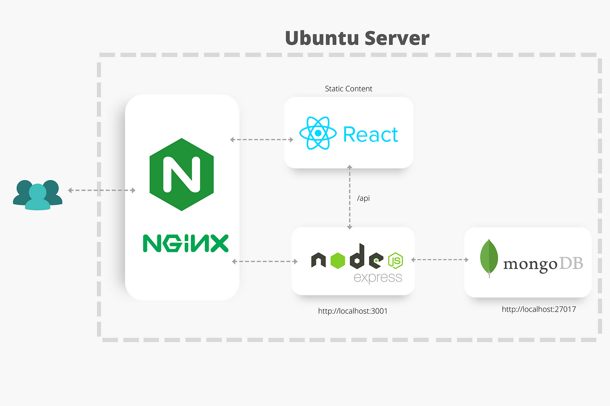
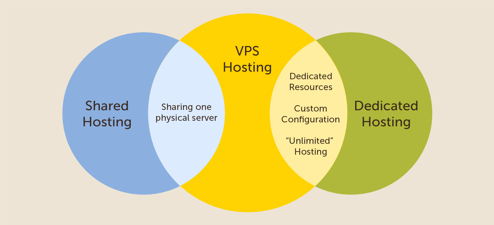
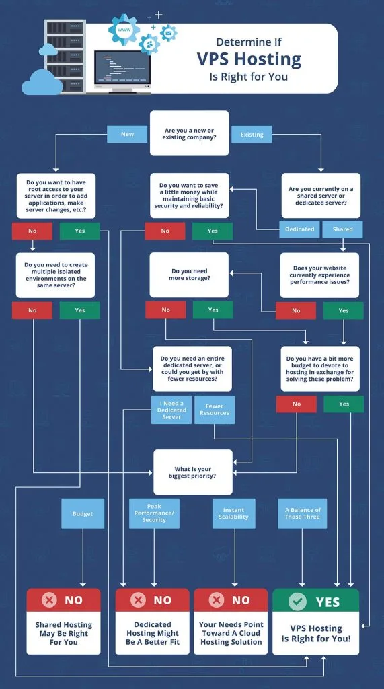
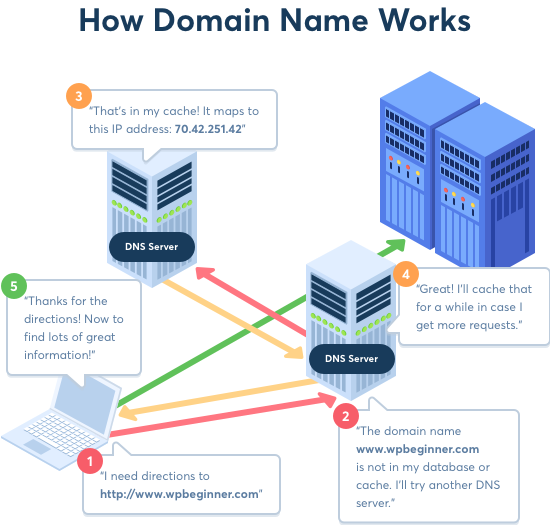
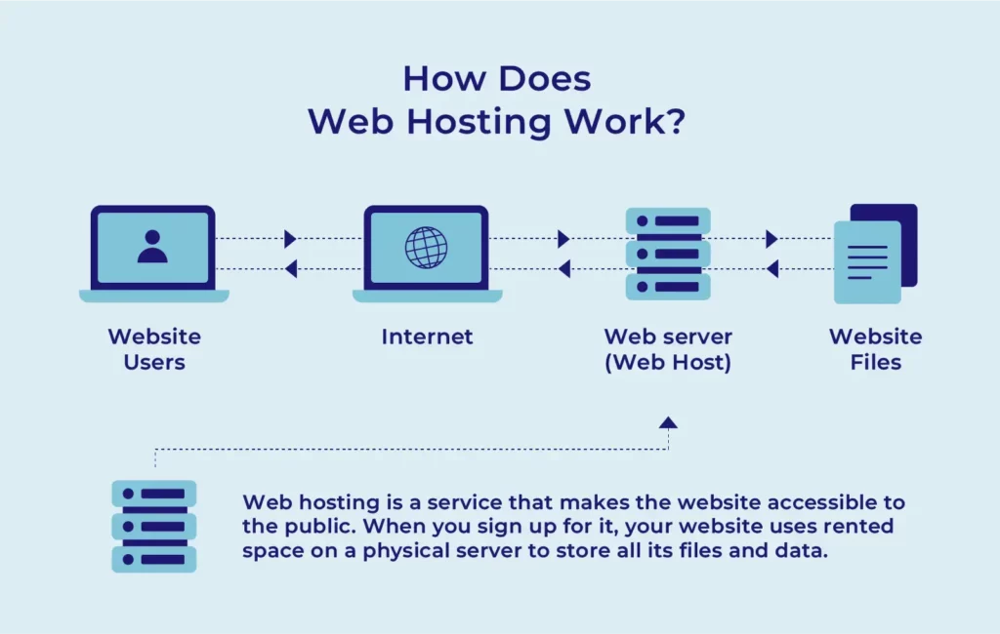
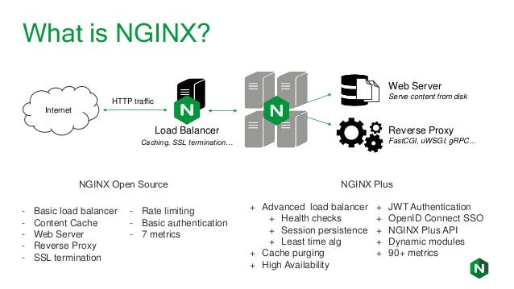

# Deploying a fullstack js app on a VPS with Nginx 

[⬅ Version Française](./README-FR)

## Introduction

### Deployment overview

### Virtual private server - VPS

### Domain name System - DNS

### Web server & reverse proxy

## Preparation

### Choosing a vps

### Choosing a domain name

### Link the domain name to the vps

## Configure your vps

### Update packages

### Install dependencies

### Install a process manager
[warning] => à bien distinguer des dépendencies ? Pourquoi un process manager ? à quoi ça sert ?

## Install and configure a database

### Default installation and configuration

### Authentication configuration

### Create a user and manage permissions

## Install and configure a web server & reverse-proxy

### Default installation and configuration

### Creating a configuration file

### Set up your SSL certificates to manage https access

### Setting up a cron job for our ssl certificates

## Configuration & deployment of a fullstack js app

### Adding minimal security headers

### Set environment variables in production and install dependencies

### Transfer the application to your vps

### Launch your application with pm2

