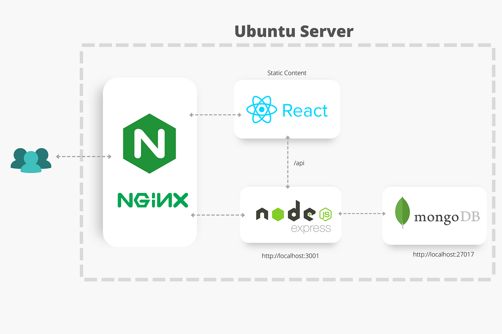
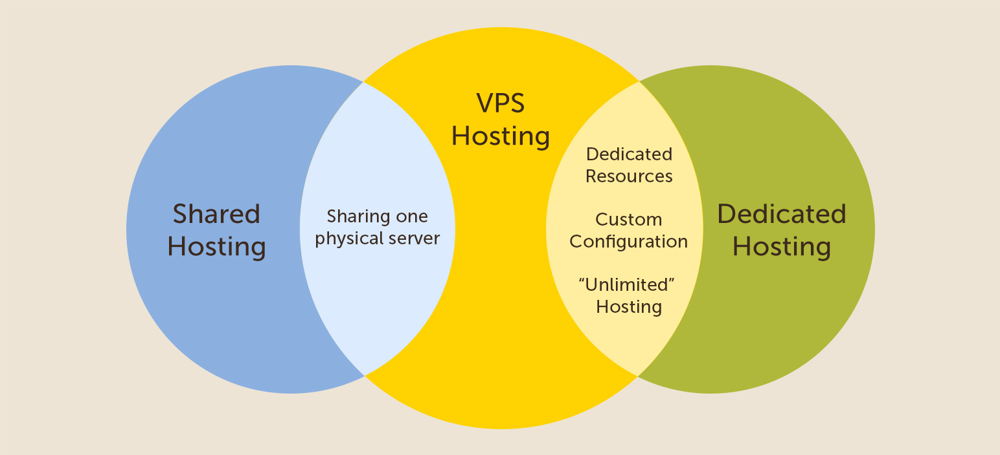
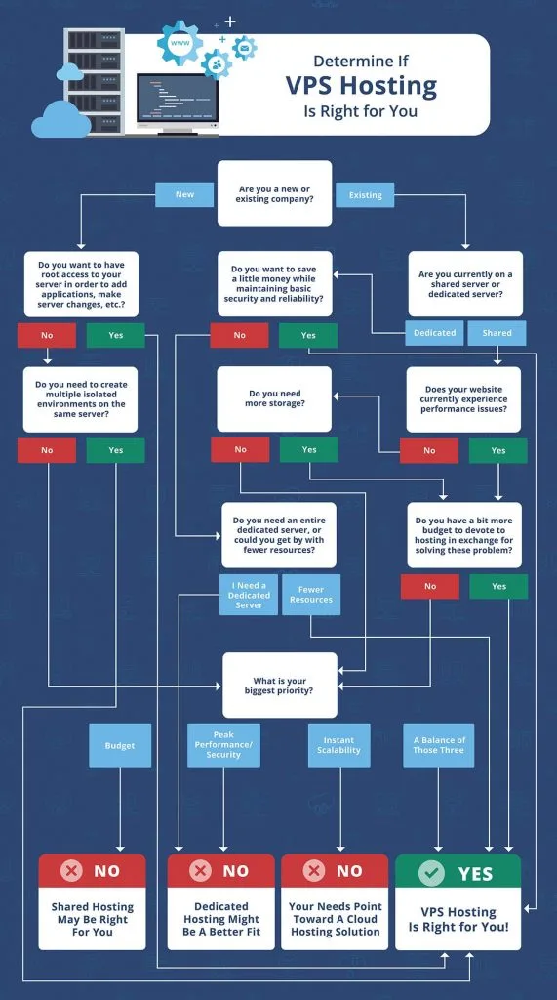
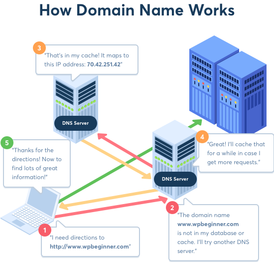
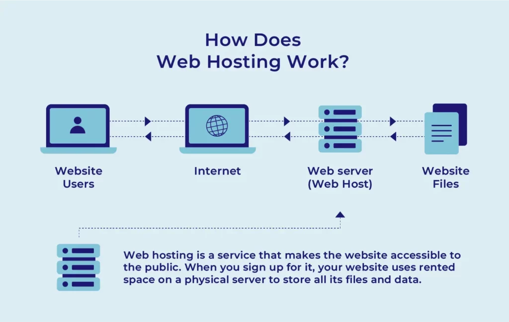
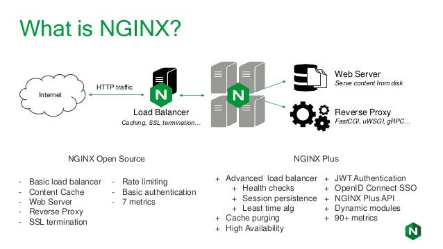
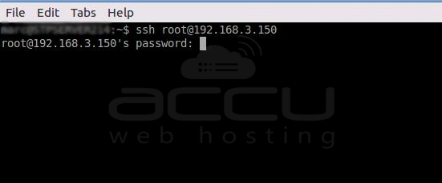

# Deploying a fullstack js app on a VPS with Nginx 

[⬅ Version Française](./README-FR)


## Introduction

### Deployment overview



### Virtual private server - VPS




### Domain name System - DNS



### Web server & reverse proxy






## Preparation

### Choosing a vps

In today's digital age, Virtual Private Servers (VPS) have become an integral part of web hosting, development, and server administration. VPS hosting provides the flexibility of a dedicated server while being cost-effective and easy to manage.

### Choosing a domain name

### Link the domain name to the vps


## Configure your VPS

Connecting a computer to a Virtual Private Server (VPS) is an essential skill for anyone working with web hosting, development, or server administration.

### How to Connect to a VPS

I'll walk you through the steps to connect to a VPS using SSH (Secure Shell)

Secure Shell (SSH) is a cryptographic network protocol used to securely access and manage remote computers and servers over an unsecured network.

SSH provides a secure channel for data communication and authentication, protecting sensitive information from potential eavesdropping, tampering, or unauthorized access.

  1. Open your terminal
  2. On the command line, enter the command : 
```sh 
  ssh your_user@ip_of_your_vps 
```
  3. When prompted, enter your VPS `root` password.



You’ll know that your connection was successful if you see SSH: your_ip_address_or_hostname in your terminal

You will need to log in to your VPS via SSH, using the IP address, user name and password provided by email when you received your order. 
{:.alert-info}

### Update packages

Next let's clean and update the server

Run the following command :

```sh
apt clean all && sudo apt update && sudo apt dist-upgrade
```

### Install NodeJS

One way to install Node.js that is particularly flexible is to use nvm, the Node version manager. This software allows you to simultaneously install and maintain multiple independent versions of Node.js as well as their associated Node packages.

To install the NVM on your Ubuntu machine, visit the project's GitHub page. Copy the curl command from the README file that appears on the main page. This will give you the most recent version of the installation script:
```sh
curl -o- https://raw.githubusercontent.com/nvm-sh/nvm/v0.39.7/install.sh | bash
```

Running the command above downloads a script and executes it.The script clones the nvm repository to `~/.nvm` and attempts to add the source lines from the snippet below to the correct profile file ( `~/.bash_profile`, `~/.zshrc`, `~ /.profile`or `~/.bashrc`).

We will therefore create a `.bashrc` file so that nvm can work correctly:
```sh
source ~/.bashrc
```

Now you can ask NVM which Node versions are available:
```sh
nvm list-remote
```
Now install and use the version that corresponds to your development environment or the latest stable version of nodejs with the following command:
```sh
nvm install lts
nvm use lts
```

### Install a process manager

A process manager is a tool, which provides an ability to control application lifecycle, monitor the running services and facilitate common system admin tasks to maintain your project operability.

In your terminal connected to your vps enter the following command to install pm2 : 
```sh
npm install pm2 -g
```

PM2 is a daemon process manager that will help you manage and keep your application online 24/7
{:.alert-info}

## Install and configure a database

### Default installation and configuration

### Authentication configuration

### Create a user and manage permissions


## Install and configure a web server & reverse-proxy

### Default installation and configuration

### Creating a configuration file

### Set up your SSL certificates to manage https access

### Setting up a cron job for our ssl certificates


## Configuration & deployment of a fullstack js app

### Adding minimal security headers

### Set environment variables in production and install dependencies

### Transfer the application to your vps

### Launch your application with pm2

