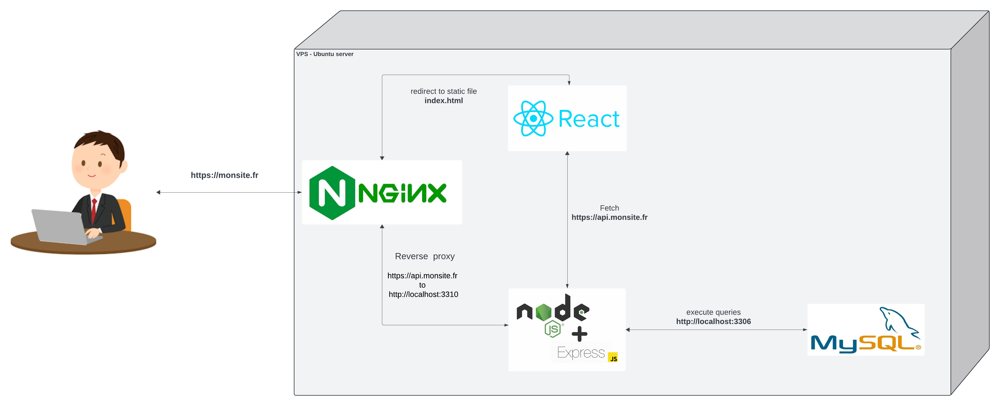

# Deploying a fullstack js app on a VPS with Nginx 

[⬅ Version Française](./README-FR)


## Introduction


A server is a computer that communicates with other computers to serve them with the information requested by these computers. These computers, also called clients, connect to a server through either a local area network (LAN) or a wide area network (WAN). A server sends and collects information across a network within multiple locations.

A web server is a server on the internet that uses the Hypertext Transfer Protocol (HTTP) to receive requests from a client, such as a browser. It then returns an HTTP response, which can be an HTML webpage or data in JSON format, as used in API calls.

Web servers, essential for data exchange, use HTTP for client-server communication. They consist of both hardware and software, crucial in web development. The software interprets URLs and manages user access to hosted files.

### Deployment overview



The deployment diagram above allows you to visualize the architecture of our server which will host both our react application as well as our express API and our mySQL database.

Let's take a look at the elements that make it up:

- The client, in other words the user of the site on a physical machine
- The server (hardware) in other words, a physical machine connected to the internet, in our case it is a virtual private server (VPS).
- Nginx, a web server (software) which allows us to manage http requests, this one is directly installed on the physical server and is used to redirect to the corresponding service in our case we have two options either our client application (react) or our api (express/harmonia).
- Static files (react)
- A NodeJS server (express/harmonia)
- A database server (mySQL)

### Web server & reverse proxy


A traditional forward proxy server allows multiple clients to route traffic to an external network. For instance, a business may have a proxy that routes and filters employee traffic to the public Internet. A reverse proxy, on the other hand, routes traffic on behalf of multiple servers.

A reverse proxy effectively serves as a gateway between clients, users, and application servers. It handles all the access policy management and traffic routing, and it protects the identity of the server that actually processes the request.

### Nginx explained

What is Nginx?

According to its documentation, Nginx (pronounced “engine X”) is an HTTP and reverse proxy server, a mail proxy server, and a generic TCP/UDP proxy server, originally written by Igor Sysoev.

Nginx is used for a variety of tasks that contribute to improving Node performance:

- Reverse proxy server: As traffic to your app increases, the best approach to improve performance is to use Nginx as a reverse proxy server in front of the Node.js server to load balance traffic across the servers. This is the core use case of Nginx in Node.js applications

- Stateless load balancing: This improves performance while reducing load on backend services by sending off client requests to be fulfilled by any server with access to the requested file
    
- Cache static contents: Serving static content in a Node.js application and using Nginx as a reverse proxy server doubles the application performance to a maximum of 1,600 requests per second

- Implement SSL/TLS and HTTP/2: Given the recent shift from using SSL/TLS to secure user interactions in Node.js applications, Nginx also supports HTTP/2 connections
    
- Performance tracking: You can keep real-time tabs on the overall performance of your Node.js application using the stats provided on Nginx’s live dashboards
    
- Scalability: Depending on what assets you’re serving, you can take advantage of the full‑featured HTTP, TCP, and UDP load balancing in Nginx to scale up your Node.js application

Nginx currently supports seven scripting languages: Go, Node.js, Perl, PHP, Python, Ruby, and Java Servlet Containers (the last is an experimental module). It enables you to run applications written in different languages on the same server.

## Preparation

### Choosing a vps

In today's digital age, Virtual Private Servers (VPS) have become an integral part of web hosting, development, and server administration. VPS hosting provides the flexibility of a dedicated server while being cost-effective and easy to manage.

As part of this workshop we will order a vps on OVH but there are plenty of equally viable service providers.

To do this, go to this [link](https://www.ovhcloud.com/fr/vps/) and configure your vps as indicated in the screenshot below


### Choosing a domain name

A domain name (often simply called a domain) is an easy-to-remember name that's associated with a physical IP address on the Internet. It's the unique name that appears after the @ sign in email addresses, and after www. in web addresses.

For order a domain name on OVH you can follow this [link](https://www.ovhcloud.com/fr/domains/)

### Link the domain name to the vps

Once your VPS is ordered you will receive an email with the connection information to it including the IP, from your OVH dashboard you will be able to link your VPS via its IP address to your domain name by configuring what we call a DNS zone.

You can follow the steps below to set up the link between your domain name and your VPS

- Access to your domain from your dashboard :


- Access to the DNS zone of your selected domain :


- link your vps ip to your domain
  - Add a new entry to your dns zone :
  
  - Select the `A` dns type entry :
  
  - add your VPS ip to the `cible` input and confirm :
  

## Configure your VPS

Connecting a computer to a Virtual Private Server (VPS) is an essential skill for anyone working with web hosting, development, or server administration.

### How to Connect to a VPS

I'll walk you through the steps to connect to a VPS using SSH (Secure Shell)

Secure Shell (SSH) is a cryptographic network protocol used to securely access and manage remote computers and servers over an unsecured network.

SSH provides a secure channel for data communication and authentication, protecting sensitive information from potential eavesdropping, tampering, or unauthorized access.

  1. Open your terminal
  2. On the command line, enter the command : 
```sh 
  ssh your_user@ip_of_your_vps 
```
  3. When prompted, enter your VPS `root` password.


You’ll know that your connection was successful if you see SSH: your_ip_address_or_hostname in your terminal

You will need to log in to your VPS via SSH, using the IP address, user name and password provided by email when you received your order. 
{:.alert-info}

### Update packages

Next let's clean and update the server

Run the following command :

```sh
apt clean all && sudo apt update && sudo apt dist-upgrade
```

### Install NodeJS

One way to install Node.js that is particularly flexible is to use nvm, the Node version manager. This software allows you to simultaneously install and maintain multiple independent versions of Node.js as well as their associated Node packages.

To install the NVM on your Ubuntu machine, visit the project's GitHub page. Copy the curl command from the README file that appears on the main page. This will give you the most recent version of the installation script:
```sh
curl -o- https://raw.githubusercontent.com/nvm-sh/nvm/v0.39.7/install.sh | bash
```

Running the command above downloads a script and executes it.The script clones the nvm repository to `~/.nvm` and attempts to add the source lines from the snippet below to the correct profile file ( `~/.bash_profile`, `~/.zshrc`, `~ /.profile`or `~/.bashrc`).

We will therefore create a `.bashrc` file so that nvm can work correctly:
```sh
source ~/.bashrc
```

Now you can ask NVM which Node versions are available:
```sh
nvm list-remote
```
Now install and use the version that corresponds to your development environment or the latest stable version of nodejs with the following command:
```sh
nvm install lts
nvm use lts
```

### Install a process manager

A process manager is a tool, which provides an ability to control application lifecycle, monitor the running services and facilitate common system admin tasks to maintain your project operability.

In your terminal connected to your vps enter the following command to install pm2 : 
```sh
npm install pm2 -g
```

PM2 is a daemon process manager that will help you manage and keep your application online 24/7
{:.alert-info}

## Install and configure a database

### Default installation and configuration

You can install MySQL using the APT package repository. 

To install it, update the package index on your server if you haven't done so recently : 

```bash
sudo apt update
```

Next, install the `mysql-server` package :

```bash
sudo apt install mysql-server
```

This will install MySQL, but will not ask you to set a password or make other configuration changes. As this makes your MySQL installation insecure, we will address this point in the next step.


### Authentication configuration

For new installations of MySQL you will need to run the security script included in the DBMS. This script changes some of the less secure default options for things like remote root logins and sample users.

Run the security script with `sudo` :

```bash
sudo mysql_secure_installation
```

You will then be guided through a series of prompts where you can make some changes to the security options of your MySQL installation.

Remember to launch the MySQL service, then check its status :
```bash
sudo service mysql start 
```


In Ubuntu systems running MySQL 5.7 (and later), the MySQL user **root** is configured to authenticate using the `auth_socket` plugin by default rather than with a password. This helps improve security and usability in many cases, but it can also complicate things if you need to allow an external program (e.g. phpMyAdmin) to access the user.

In order to use a password to connect to MySQL as **root**, you will need to change its authentication method from `auth_socket` to another plugin, such as `caching_sha2_password` or `mysql_native_password`. To do this, open the MySQL prompt from your terminal:

```bash
sudo mysql
```

To configure the **root** account so that it authenticates with a password, from the MySQL prompt issue an `ALTER USER` statement to modify the authentication plugin used and set a new password.

Be sure to replace `password` with a strong password of your choice, and remember that this command will change the **root** password you set in step before:

```sql
ALTER USER 'root'@'localhost' IDENTIFIED WITH mysql_native_password BY 'password';
```


💡 The previous `ALTER USER` statement sets the MySQL user **root** to authenticate with the `caching_sha2_password` plugin. [According to the official MySQL documentation](https://dev.mysql.com/doc/refman/8.0/en/upgrading-from-previous-series.html#upgrade-caching-sha2-password), `caching_sha2_password` is MySQL's preferred authentication plugin, as it provides more secure password encryption than the old, but still widely used, `mysql_native_password`
{:.alert-info}


⚠️ However, many applications do not work reliably with `caching_sha2_password`. If you plan to use this database with a PHP application or connect via an orm like sequelize, you can set **root** to authenticate with `mysql_native_password` instead:
```sql
ALTER USER 'root'@'localhost' IDENTIFIED WITH mysql_native_password BY 'password';
```
{:.alert-info}

Then run `FLUSH PRIVILEGES` which puts your new changes into effect:

```sql
FLUSH PRIVILEGES;
```

### Create a user and manage permissions

Upon installation, MySQL creates a root user account which you can use to manage your database. This user has full privileges over the MySQL server, meaning it has complete control over every database, table, user, and so on. Because of this, it’s best to avoid using this account outside of administrative functions. This step outlines how to use the root MySQL user to create a new user account and grant it privileges.

Once you have access to the MySQL prompt, you can create a new user with a CREATE USER statement. These follow this general syntax:

```sql
CREATE USER 'username'@'host' IDENTIFIED WITH mysql_native_password BY 'yourpassword';
```

After CREATE USER, you specify a username. This is immediately followed by an @ sign and then the hostname from which this user will connect. If you only plan to access this user locally from your Ubuntu server, you can specify localhost. Wrapping both the username and host in single quotes isn’t always necessary, but doing so can help to prevent errors.

The general syntax for granting user privileges is as follows:

```sql
GRANT PRIVILEGE ON database.table TO 'username'@'host';
```

The PRIVILEGE value in this example syntax defines what actions the user is allowed to perform on the specified database and table. You can grant multiple privileges to the same user in one command by separating each with a comma. You can also grant a user privileges globally by entering asterisks (*) in place of the database and table names. In SQL, asterisks are special characters used to represent “all” databases or tables.

Run this GRANT statement, replacing `username` with your own MySQL user’s name, to grant these privileges to your user:

```sql
GRANT CREATE, ALTER, DROP, INSERT, UPDATE, DELETE, SELECT, REFERENCES, RELOAD on *.* TO 'username'@'localhost' WITH GRANT OPTION;
```

Note that this statement also includes WITH GRANT OPTION. This will allow your MySQL user to grant any permissions that it has to other users on the system.

Then run `FLUSH PRIVILEGES` which puts your new changes into effect:

```sql
FLUSH PRIVILEGES;
```

## Install and configure a web server & reverse-proxy

### Default installation and configuration

Nginx is a popular package included in nearly all Linux distribution repositories, including Ubuntu 24.04, though the version provided is often older but still great for production use cases.

So, to install Nginx on Ubuntu using the package manager, open your terminal and execute the following command:

```bash
sudo apt install nginx
```

You can then verify that nginx is working correctly with the following command

```bash
sudo service nginx status
```


If the nginx service is not started, use the following command: 

```bash
sudo service nginx start
```

Then enter your server's IP or domain name into your browser's address bar:

```http://your_server_ip```

You should get the default Nginx home page:


If you arrived at this page, it means that your server is working correctly and you can now manage it!

PS - The default Nginx configuration is located in `etc/nginx/sites-enabled/`. There she is :

```yaml
##
# You should look at the following URL's in order to grasp a solid understanding
# of Nginx configuration files in order to fully unleash the power of Nginx.
# http://wiki.nginx.org/Pitfalls
# http://wiki.nginx.org/QuickStart
# http://wiki.nginx.org/Configuration
#
# Generally, you will want to move this file somewhere, and start with a clean
# file but keep this around for reference. Or just disable in sites-enabled.
#
# Please see /usr/share/doc/nginx-doc/examples/ for more detailed examples.
##

# Default server configuration
#
server {
        listen 80 default_server;
        listen [::]:80 default_server;

        # SSL configuration
        #
        # listen 443 ssl default_server;
        # listen [::]:443 ssl default_server;
        #
        # Note: You should disable gzip for SSL traffic.
        # See: https://bugs.debian.org/773332
        #
        # Read up on ssl_ciphers to ensure a secure configuration.
        # See: https://bugs.debian.org/765782
        #
        # Self signed certs generated by the ssl-cert package
        # Don't use them in a production server!
        #
        # include snippets/snakeoil.conf;

        root /var/www/html;

        # Add index.php to the list if you are using PHP
        index index.html index.htm index.nginx-debian.html;

        server_name _;

        location / {
                # First attempt to serve request as file, then
                # as directory, then fall back to displaying a 404.
                try_files $uri $uri/ =404;
        }

        # pass the PHP scripts to FastCGI server listening on 127.0.0.1:9000
        #
        #location ~ \.php$ {
        #       include snippets/fastcgi-php.conf;
        #
        #       # With php7.0-cgi alone:
        #       fastcgi_pass 127.0.0.1:9000;
        #       # With php7.0-fpm:
        #       fastcgi_pass unix:/run/php/php7.0-fpm.sock;
        #}

        # deny access to .htaccess files, if Apache's document root
        # concurs with nginx's one
        #
        #location ~ /\.ht {
        #       deny all;
        #}
}

# Virtual Host configuration for example.com
#
# You can move that to a different file under sites-available/ and symlink that
# to sites-enabled/ to enable it.
#
#server {
#       listen 80;
#       listen [::]:80;
#
#       server_name example.com;
#
#       root /var/www/example.com;
#       index index.html;
#
#       location / {
#               try_files $uri $uri/ =404;
#       }
#}
```

The `server` directive allows you to group together the different actions to be carried out for a group. In jargon, a group is a "virtual server". [Learn more](https://nginx.org/en/docs/http/ngx_http_core_module.html#server)
{:.alert-info}

ℹ️ The line `listen 80 default_server;` indicates that port 80 is used. Thus, all traffic to the URL "ipaddress:80" will be processed by this set (by default browsers query port 80 in http and port 443 in https). [Learn more](https://nginx.org/en/docs/http/ngx_http_core_module.html#listen)
{:.alert-info}

ℹ️ The `root` directive which indicates the path to the base folder of the files to be returned (useful in the case of static file rendering). By default nginx is configured to search in the `var/www/html;` folder.
As for the home page, it is designated by the directive `index`: `index index.html index.htm index.nginx-debian.html;`. Look in the `/var/www/html` folder: you will indeed find the `index.nginx-debian.html` file there.
{:.alert-info}

ℹ️ The `server_name` directive allows you to indicate the **domain name**, or the **IP address**, targeted by the group (virtual server). [Learn more in the documentation](https://nginx.org/en/docs/http/server_names.html).
{:.alert-info}

ℹ️ The next directive is `location`. It refers to the **relative path** which is in the URL (the URI) and takes a regular expression or a character string as an argument. Small subtlety: if the argument is a string, the URI must **start** with it. ! In this example, only a forward slash is specified: `/`. This means that all requests with a URI starting with `/` will have to apply the block's directives. [Learn more](https://nginx.org/en/docs/http/ngx_http_core_module.html#location)
{:.alert-info}

ℹ️ The `try_files` directive (useful in case of static file rendering) within the `location` block when it checks the existence of files passed as an argument in order of priority. 
The example also indicates: `try_files $uri $uri/ =404;` . What's going to happen ? 
Nginx will fetch the file from the server following the path passed in the URL. For example, it will navigate to `root_file/static/metallica.png` if the URI is `/static/metallica.png`. If it is not found, it will try to find the folder. 
For example: `/static/metallica.png/`. If the file is still absent, it will return a 404 error.
{:.alert-info}

### Creating a configuration file

By convention, configuration files are grouped in the `sites-enabled` folder. They are all taken into account in the same way. This folder does not strictly speaking contain any real files, the default file that we saw previously was in fact a symbolic link, the real file is located in `etc/nginx/sites-available/`

💡 A symbolic link refers to a file saved elsewhere in the system. So if you ask to open `nginx/sites-enabled/defaut`, the system will open `nginx/sites-available/default`.
{:.alert-info}

To start you can therefore delete the default file in `sites-enabled`, then go to `sites-available` and create a new configuration file, generally we name the configuration file with the domain name or subdomain towards which the virtual server that will have been defined there points: `mydomain.com`, this includes the fact that we will only declare a single `server` block directive 

```bash
sudo touch mydomain.com
```

Then create a symbolic link from this file to the `sites-enabled` folder:

```bash
sudo ln -s /etc/nginx/sites-available/mydomain.com /etc/nginx/sites-enabled/mydomain.com
```

#### Option 1 (API/express) - Reverse proxy configuration to redirect to a local server

A [**Nginx HTTPS reverse proxy**](https://nginx.org/) is an intermediary proxy service that takes a client request, forwards it to one or more servers, and then sends the server's response back to the client. While most common applications can run as a web server on their own, the Nginx web server is capable of providing a number of advanced features such as load balancing, TLS/SSL capabilities, and acceleration. which most specialized applications lack. By using an Nginx reverse proxy, all applications can benefit from these features.

To pass a request to an HTTP proxy server, the [proxy_pass](https://nginx.org/en/docs/http/ngx_http_proxy_module.html#proxy_pass) directive is specified inside a [location] directive block (https://nginx.org/en/docs/http/ngx_http_core_module.html#location). For example: 

```yaml
location / {
    proxy_pass http://localhost:3000
}
```

ℹ️ This example configuration causes all requests processed at this location to be forwarded to the proxy server at the specified address. This address can be specified as a domain name or an IP address. The address can also include a port
{:.alert-info}

So let's get down to business, edit your `mydomain.com` file previously created in the `sites-available` folder and add the following code: 

```yaml
server 
{
       server_name mydomain.com;

       location /api 
       {
								proxy_set_header Host $host;
							  proxy_set_header X-Real-IP $remote_addr;
                proxy_pass http://localhost:3310;

        }

}
```

ℹ️ `proxy_set_header` rewrites the headers of the HTTP request. This allows you to transmit to your application all the information of the user making the request (host, ip, etc.)
For more information on headers with nginx:
https://docs.nginx.com/nginx/admin-guide/web-server/reverse-proxy/#passing-request-headers
{:.alert-info}

And that's it, now nginx will redirect all http requests made on the specified domain name to your local application! We will see below the implementation of ssl certificate via certbot to configure https access but reassure you, we will no longer have to touch this configuration file.

#### Option 2 (React) - Configuration for static file rendering

You can use nginx to allow your web server to render static files, this is particularly useful for applications from scratch in php but also to allow public access to resources such as images or to make a site static in html

To serve static files we use the [root](https://nginx.org/en/docs/http/ngx_http_core_module.html#root) directive specifying the path to the source folder inside a directive block [location](https://nginx.org/en/docs/http/ngx_http_core_module.html#location), we also add the directive [index](https://nginx.org/en/docs/http /ngx_http_index_module.html#index) to specify the file to load by default, multiple files can be specified in this directive. For example : 

```yaml
location / 
{
    root /var/www/html/mydomain.com;
		index index.html app.html;
}
```

Let's now see the configuration to allow a react build application to be put online for production, edit your `mydomain.com` and add the new location bloc as following:

```yaml
server 
{
      server_name mydomain.com;

      location /api 
      {
							proxy_set_header Host $host;
						  proxy_set_header X-Real-IP $remote_addr;
              proxy_pass http://localhost:3310;

      }

      location / 
      {
              root /var/www/html/reactapp/build;
              index index.html index.htm;
              try_files $uri $uri/ /index.html;
      }

}
```

Nothing new here is the addition of the [try_files](https://nginx.org/en/docs/http/ngx_http_core_module.html#try_files) directive which can be used to check if the file or the specified directory exists and otherwise perform a redirection to a url, a file or even just returned an http code status.

In the code above we used this directive because in the case of a react application if the user were to access our application with an endpoint different from the entry point defined by our location directive, nginx would return an error 404.. 

To manage this we redirect to the index.html file then react router does its work to dynamically load the corresponding page!

In the case where you have also implemented a file upload on your application via multer, you will also need to add to our configuration file access to the upload folder via the following location block : 

```yaml
server 
{
      server_name mydomain.com;

      location /api 
      {
							proxy_set_header Host $host;
						  proxy_set_header X-Real-IP $remote_addr;
              proxy_pass http://localhost:3310;
      }

      location / 
      {
              root /var/www/html/monprojet/client/dist;
              index index.html index.htm;
              try_files $uri $uri/ /index.html;
      }

      location /upload 
      {
              proxy_http_version 1.1;
              proxy_set_header Upgrade $http_upgrade;
              proxy_set_header Connection 'upgrade';
              proxy_pass "http://localhost:3310/upload/";

              # preflight requests
              if ( $request_method = OPTIONS ) 
              {
                  add_header "Access-Control-Allow-Origin" *;
                  add_header "Access-Control-Allow-Credentials" true;
                  add_header "Access-Control-Allow-Methods" "GET, POST, PUT, HEAD, DELETE, OPTIONS";
                  add_header "Access-Control-Allow-Headers" "Authorization, Origin, X-Requested-With, Content-Type, Accept";
                  return 200;
              }
      }


}
```


### Set up your SSL certificates to manage https access

To generate your ssl certificate and automatically set up the nginx configuration necessary for https access and http to https redirection, for this you must first install snapd a software manager for linux then install certbot via the snap command: 

```bash
sudo apt install snapd
sudo snap install --classic certbot
```

From there, all we have to do is run the certbot command to generate a new ssl certificate for a domain name and update the nginx configuration: 

```bash
sudo certbot --nginx -d mydomain.com
```

### Setting up a cron job for our ssl certificates

[Cron](https://en.wikipedia.org/wiki/Cron) is a time-based task scheduling daemon found in Unix-like operating systems, including distributions Linux. Cron runs in the background and tasks scheduled with cron, called “cron jobs,” are executed automatically, making cron useful for automating maintenance-related tasks.

Almost all Linux distributions include some form of cron installed by default. However, if you are using an Ubuntu machine that does not have cron installed, you can install it using APT: 

```bash
sudo apt install cron
sudo systemctl enable cron
```

#### Foreword - understanding cron jobs:

Cron jobs are saved and managed in a special file called `crontab`. Each user profile in the system can have its own crontab where it can schedule jobs.

To schedule a job, simply open your crontab for editing and add a task written as a *cron expression*. The syntax for cron expressions can be broken down into two elements: the schedule and the command to execute.

Together, the tasks scheduled in a crontab are structured like this:

```bash
minute hour day_of_month month day_of_week command_to_run
```

Here is a working example of a cron expression. This expression runs the command `curl http://www.google.com` every Tuesday at 5:30 p.m.:

```
30 17 * * 2 curl http://www.google.com
```

As mentioned previously, a crontab is a special file that contains the schedule of jobs that the cron will run. However, they are not intended to be edited directly. Instead, it is recommended to use the `crontab` command. This allows you to change the crontab of your user profile without changing your privileges with `sudo`. The `crontab` command will also let you know if you have any syntax errors in the crontab, while editing it directly will not.

You can modify your crontab with the following command:

```bash
crontab -e
```

⚠️ If you want to execute a sudo command in the form of a cronjob you must edit the crontab of the super user and not the current user, example:
```bash
sudo crontab -e
```
then set your cron job without specifying the sudo keyword in front of the command
{:.alert-info}

If this is the first time you have run the `crontab` command under this user profile, it will prompt you to select a default text editor to use to edit your crontab: Enter the number corresponding to the text editor your choice. You can also press the `ENTER` key to accept the default choice.

After making your selection, you will be taken to a new crontab containing some commented instructions on how to use it, you can enter your schedule with each job on a new line: 


In the cronjob example above we run the certbot renew —dry-run command on the first day of January each year.

In conclusion, start by editing the sudo cron job: 

```bash
sudo crontab -e
```

Then at the end of the file add the following line before returning to the new line: 

```bash
0 0 1 1 * certbot renew --dry-run
```

And there you have it, your certificates will be automatically updated every year, you can modify the cron job so that it runs every 3 months for example (see table of values ​​above).

## Configuration & deployment of a fullstack js app

### Transfer the application to your vps

There are several options for transferring our application to a vps, with the terminal via the scp protocol or via an ftp connection with a graphical tool like filezilla but the simplest option is still to use git to simply clone our repository directly on our vps directly in the `/var/www/html` (if the folder doesn't exist just create it) :

```bash
git clone git@github.com:yourusername/yourrepository.git
```

### Set environment variables in production and install dependencies

First we will need to define our .env in the `client` and `server` folders by defining at least the database connection information as well as the client and api url so that it now points to our name domain (https) rather than localhost

`/client/.env` : 
```bash
# Server API URL (call it in React with import.meta.env.VITE_API_URL)
VITE_API_URL=https://mondomain.com/api

# Other Environment Variables (if needed)
# VITE_OTHER_VARIABLE=value
```

`/server/.env` : 
```bash
# Application Configuration
APP_PORT=3310
APP_HOST=https://mondomain.com # this part is important if you have file upload
APP_SECRET=defineasupersecretkeyhere

# Database Configuration
DB_HOST=localhost
DB_PORT=3306
DB_USER=mysqlUser
DB_PASSWORD=MysqlUserPassword
DB_NAME=databasename
# Client URL (for CORS configuration)
CLIENT_URL=https://mondomain.com
```

If you have implemented a file upload via multer you will need to modify the generation of your image URLs using the APP_HOST environment variable defined previously, example : 

```js
const uploadDest = `${process.env.APP_HOST}/upload/`;
if (req.files.picture_jewell)
  req.body.picture_jewell = uploadDest + req.files.picture_jewell[0].filename;

```

Important thing also if you ever use cookies for example to set up a refreshToken system you must add the secure option to true when generating your cookie :

```js
res
.status(200)
.cookie("refreshToken", refreshToken, {
  HttpOnly: true,
  sameSite: "lax",
  expires: new Date(Date.now() + 900000000),
	secure: true // this is required for https
})

```

When you done you can now install the dependencies and execute your database migration script from the root folder of your project : 

```bash
npm install
```

```bash
npm run db:migrate
```

### Build your react app

A react application must be built to generate compressed file, we have access to a build command via npm which allows us to generate a dist folder which contains the build of our react application, run the following command from your `client` folder :

```bash
npm run build
```

### Launch your api with pm2

Now we need to start a local server for our api with pm2 which will be link using a reverse proxy as defined in our nginx configuration, run the following command from your `server` folder : 

```bash
pm2 start index.js --name=myappname
```
# Congratulation

Now try to access to your domain to see if all works properly, if not call your instructor !

 congratulation you have deployed you first fullstack application ! 


